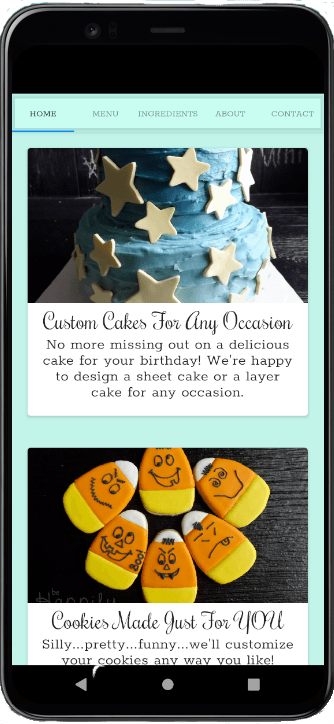
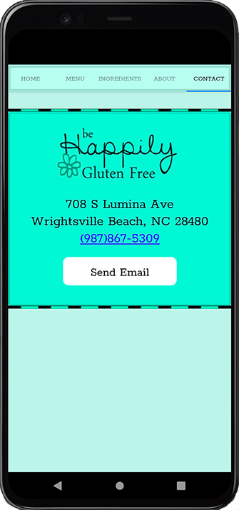

# BHGF-React-Native-Portfolio-Project

<!-- PROJECT LOGO -->
 

  

<h3 align="center">Be Happily Gluten Free Bakery & Cafe</h3>

  

    This app is designed to compliment the Be Happily Gluten Free Bakery & Cafe fictitious websites that I built as portfolio projects in Bootstrap and React during my time as a student at Nucamp Computer Programming Bootcamp
     
    <a href="https://github.com/jackie-shawley/BHGF-React-Native-Portfolio-Project.git"><strong>Explore the docs »</strong></a>
     
 

<!-- ABOUT THE PROJECT -->
## About The Project

<!--  -->
Home Page             |  Ingredients Page             |  Contact Page
:-------------------------:|:-------------------------:|:-------------------------:
  |    |  

`jackie-shawley`, `BHGF-React-Native-Portfolio-Project`, `https://www.linkedin.com/in/jackie-kopco-shawley/`, `jackiekopcoshawley@gmail.com`, `Be Happily Gluten Free React Portfolio Project`

(<a href="#top">back to top</a>)

  
# Dependencies

### `yarn`
Yarn installation instructions <a href="https://classic.yarnpkg.com/lang/en/docs/install/#mac-stable">here</a>

### `expo-cli`
Installation instructions <a href="https://docs.expo.dev/workflow/expo-cli/#installation">here</a>\

Or install with Yarn using $ yarn add expo-cli

## Available Scripts

In the project directory, you can run:

### `expo start`

Runs the app in the development mode.

### `expo start --ios`
Opens your app in Expo Go in a currently running iOS simulator on your computer

### `expo start --android`
Opens your app in Expo Go on a connected Android device

### `expo start --web`
Opens your app in a web browser

## Learn More

You can learn more in the [React Native documentation](https://reactnative.dev/docs/getting-started).

<!-- CONTRIBUTING -->
## Contributing

Contributions are what make the open source community such an amazing place to learn, inspire, and create. Any contributions you make are **greatly appreciated**.

If you have a suggestion that would make this better, please fork the repo and create a pull request. You can also simply open an issue with the tag "enhancement".
Don't forget to give the project a star! Thanks again!

1. Fork the Project
2. Create your Feature Branch (`git checkout -b feature/AmazingFeature`)
3. Commit your Changes (`git commit -m 'Add some AmazingFeature'`)
4. Push to the Branch (`git push origin feature/AmazingFeature`)
5. Open a Pull Request

(<a href="#top">back to top</a>)

<!-- LICENSE -->
## License

Distributed under the MIT License. See `LICENSE.txt` for more information.

(<a href="#top">back to top</a>)

<!-- CONTACT -->
## Contact

Jackie Shawley - https://www.linkedin.com/in/jackie-kopco-shawley - email@jackiekopcoshawley@gmail.com

Project Link: [https://github.com/jackie-shawley/BHGF-React-Portfolio-Project.git](https://github.com/jackie-shawley/BHGF-React-Native-Portfolio-Project.git)

(<a href="#top">back to top</a>)

<!-- MARKDOWN LINKS & IMAGES -->
<!-- https://www.markdownguide.org/basic-syntax/#reference-style-links -->
[contributors-shield]: https://img.shields.io/github/contributors/github_username/repo_name.svg?style=for-the-badge
[contributors-url]: https://github.com/github_username/repo_name/graphs/contributors
[forks-shield]: https://img.shields.io/github/forks/github_username/repo_name.svg?style=for-the-badge
[forks-url]: https://github.com/github_username/repo_name/network/members
[stars-shield]: https://img.shields.io/github/stars/github_username/repo_name.svg?style=for-the-badge
[stars-url]: https://github.com/github_username/repo_name/stargazers
[issues-shield]: https://img.shields.io/github/issues/github_username/repo_name.svg?style=for-the-badge
[issues-url]: https://github.com/github_username/repo_name/issues
[license-shield]: https://img.shields.io/github/license/github_username/repo_name.svg?style=for-the-badge
[license-url]: https://github.com/github_username/repo_name/blob/master/LICENSE.txt
[linkedin-shield]: https://img.shields.io/badge/-LinkedIn-black.svg?style=for-the-badge&logo=linkedin&colorB=555
[linkedin-url]: https://linkedin.com/in/linkedin_username
[product-screenshot]: images/screenshot.png
